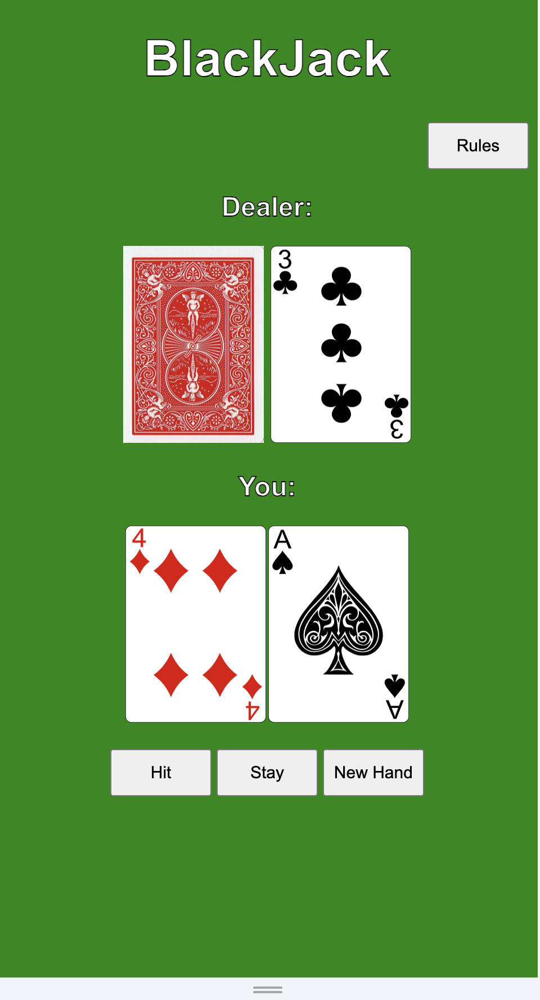
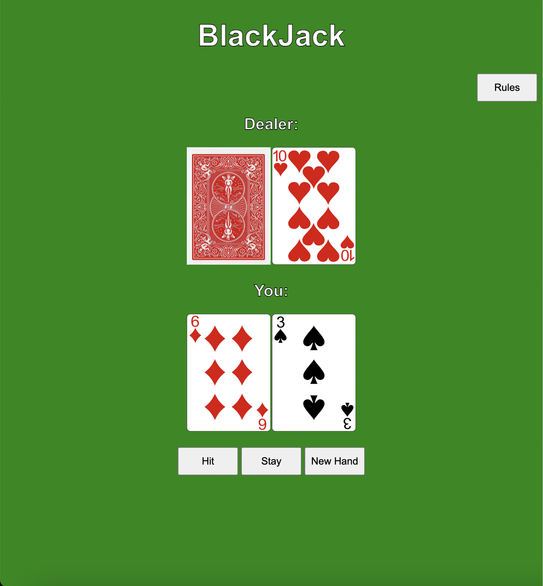

# BlackJack in JavaScript, CSS, HTML

This is my attempt at making a blackjack game with just JS, HTML and CSS.

[Link to Joseph's BlackJack Game](https://josephcho29.github.io/Blackjack/)

## **Basic Rules to the game:

1. The objective of Blackjack is to beat the dealer's hand without going over 21.
2. Number cards are worth their face value, face cards (J, Q, K) are worth 10, and Aces can be worth 1 or 11.
3. Each player starts with two cards, one of the dealer's cards is hidden until the end.
4. To 'Hit' is to ask for another card. To 'Stay' is to hold your total and end your turn.
5. If you go over 21 you bust, and the dealer wins regardless of the dealer's hand.
6. If you are dealt 21 from the start (Ace & 10), you got a blackjack.
7. Dealer will hit until his/her cards total 17 or higher.

## Furthering the project

1. Can implement a betting function to the game.

2. implement a split option.

3. Improve the styling and transitions of cards

4. add sounds for winning, losing, betting, card flips etc.

### Pseudocode from day 1

// User StoryPseudocode

//1. Declare 4 global variables.
//    1first variable keeps track of number of cards that .ave been pulled from deck. maybe : numCardsPulled
//    2.*actually an object* one for "player" holds entities cards, score
//    3."dealer's - holds cards and score
//    4.object that holds 2 functions- initialize the "deck of cards and one for shuffling deck. need to be initiated by player with a button 
//2. Create HTML elements (two 
s) for the card decks:
//3. Deck 2(actually "player's hand where the cards go for player) should display an empty card outline.
//4. Deck 3("dealer's" hand) should display an empty card outline.
//5. Create cached element references for each of the card decks.
//6. Add an event listener for the "hit" & "stand" button.
//7. Write an initialization function that assigns 52 cards" to deck 1, then invoke it.
//8. Declare a render() function to display a card after it is flipped.
// **if possible add a bet and new game/reset feature

// **if possible want to add multiple decks

// **if possible add a split option?
